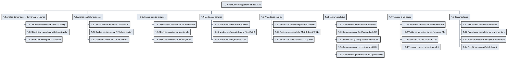

```plantuml
@startwbs
<style>
wbsDiagram {
  BackgroundColor white
  Node {
    Padding 10
    Margin 10
    BackgroundColor #E2E8F0
    BorderColor #475569
    FontName Times New Roman
  }
  arrow {
    LineColor #475569
  }
}
</style>

* 1.0 Proiectul Verdikt (Sistem hibrid SAST)
** 1.1 Analiza domeniului și definirea problemei
*** 1.1.1 Studierea metodelor SAST și CodeQL
*** 1.1.2 Identificarea problemei fals-pozitivelor
*** 1.1.3 Formularea scopului și ipotezei
** 1.2 Analiza soluțiilor existente
*** 1.2.1 Analiza instrumentelor SAST clasice
*** 1.2.2 Evaluarea sistemelor AI (Vulnhalla, etc.)
*** 1.2.3 Definirea abordării hibride Verdikt
** 1.3 Definirea soluției propuse
*** 1.3.1 Descrierea conceptului de arhitectură
*** 1.3.2 Definirea cerințelor funcționale
*** 1.3.3 Definirea cerințelor nefuncționale
** 1.4 Modelarea soluției
*** 1.4.1 Elaborarea arhitecturii Pipeline
*** 1.4.2 Modelarea fluxului de date (TaintPath)
*** 1.4.3 Elaborarea diagramelor UML
** 1.5 Proiectarea soluției
*** 1.5.1 Proiectarea backend (FastAPI/Docker)
*** 1.5.2 Proiectarea modulelor ML (XGBoost/GNN)
*** 1.5.3 Proiectarea interacțiunii LLM și RAG
** 1.6 Realizarea soluției
*** 1.6.1 Dezvoltarea infrastructurii backend
*** 1.6.2 Implementarea SarifParser (CodeQL)
*** 1.6.3 Antrenarea și integrarea modelelor ML
*** 1.6.4 Implementarea orchestratorului LLM
*** 1.6.5 Dezvoltarea generatorului de rapoarte PDF
** 1.7 Testarea și validarea
*** 1.7.1 Colectarea seturilor de date de testare
*** 1.7.2 Validarea metricilor de performanță ML
*** 1.7.3 Evaluarea calității validării LLM
*** 1.7.4 Testarea end-to-end a sistemului
** 1.8 Documentarea
*** 1.8.1 Redactarea capitolelor teoretice
*** 1.8.2 Redactarea capitolelor de implementare
*** 1.8.3 Elaborarea concluziilor și documentației
*** 1.8.4 Pregătirea prezentării de licență
@endwbs
```
